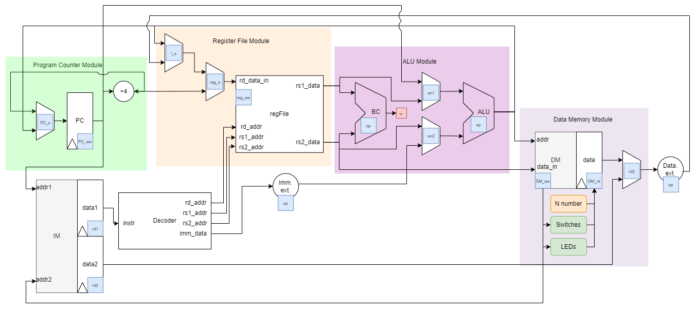
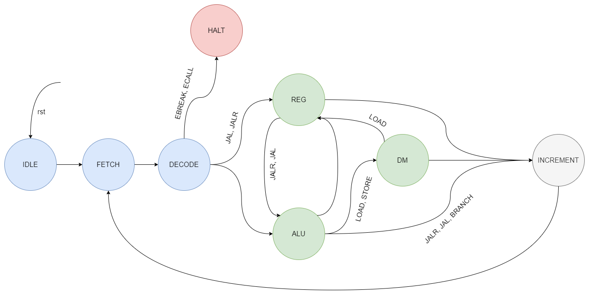

# NYU-6463-RV32I Processor Design

Welcome to the NYU-6463-RV32I Processor Design project. This repo provides a comprehensive overview of our RISC V R32I processor design project.

## Complete Design Datapath

A visual representation of the complete datapath of the designed RISC V R32I processor is provided here. This includes major components such as the Program Counter (PC), Control Unit (CU), Instruction Memory (IM), Data Memory (DM), Arithmetic Logic Unit (ALU), and Register File (Reg File).

## Finite State Machine (FSM) in Processor Design

In processor design, a Finite State Machine (FSM) plays a critical role in modeling the control logic responsible for coordinating various processor components such as the instruction fetch unit, decoder, and execution unit. It defines a series of steps for the orderly execution of instructions, encompassing stages like instruction fetching, decoding, and execution, each governed by specific conditions.

### Key Characteristics of the FSM:

- **States**: The FSM operates with a set of 8 distinct states, each representing a specific phase in the processor's operation. These states include fundamental stages like instruction fetching, decoding, and execution.

- **Inputs**: Inputs to the FSM are sourced from various components, such as the instruction memory and register files. These inputs influence the behavior of the processor and determine state transitions within the FSM.

- **Outputs**: One of the primary functions of the FSM is to generate outputs that control the behavior of various processor components. These outputs might include information such as the address of the next instruction to be executed, decoder signals for instruction interpretation, or data read from the register file.

- **Transitions**: Transitions between states are orchestrated by the FSM based on a combination of inputs and the current state. For example, when an instruction is fetched successfully, the FSM transitions from the "fetch" state to the "decode" state.

- **Next State Logic**: The determination of the next state is a crucial aspect of FSM design. This is achieved through the use of logic circuits, which can include multiplexers, decoders, or programmable logic elements like lookup tables and state machines.

The FSM serves as the backbone of the processor's control unit, ensuring that instructions are executed in a well-defined sequence and that the necessary data and signals are routed to the appropriate components at each stage of execution.

## Design Analysis

In the realm of processor design, performance and area analysis are of paramount importance. These analyses are essential for evaluating the overall effectiveness of a design. Various metrics come into play, providing insights into both performance and physical attributes. In terms of performance analysis, metrics such as clock frequency (indicating maximum execution speed, e.g., close to 100MHz for NYU-6463-RV32I), Instructions per Second (IPS, reflecting task completion rate), and CPI (Cycles per Instruction, with NYU-6463-RV32I boasting a CPI of 2) are instrumental. On the other hand, area analysis involves assessing the size and complexity of the processor. Metrics like gate count (quantifying logic gate numbers) and power consumption (influenced by factors like clock frequency, IPS, and processor complexity) are key in this evaluation. Additionally, timing analysis verifies the design's adherence to timing requirements, while resource utilization demonstrates efficient allocation of components such as block RAM and bonded pins.

## Testing

Testing for the RV32I processor encompassed various stages:

### Unit Testing

The RV32I processor underwent comprehensive unit testing, systematically evaluating all 40 supported instructions. Each instruction's expected output was validated against the testbench, with data memory initialized beforehand. This approach allowed flexibility for users to modify input data, ensuring robust testing of all potential corner cases. Successful completion of this testbench indicated the design's accuracy and alignment with performance and power targets. It also revealed areas for optimization and the potential addition of more instructions or features.

### High-Level Testing

#### Input Output Testing

This test aimed to control LEDs and switches connected to the processor. An assembly program was written for this purpose, demonstrating successful control of LEDs using switches.

#### Generating Fibonacci Series

This simulation assessed the processor's performance and correctness in executing a Fibonacci series generation program. The results showed correct execution, suggesting the processor's suitability for fast and efficient mathematical computations.

#### RC5 Encryption

The goal here was to evaluate the processor's performance and correctness in executing an RC5 encryption program. The simulation results demonstrated correct execution and high performance, with an execution time of 500 microseconds and a CPI of 2.00. This indicated efficient program execution.

### Support for C

To facilitate C program development, GCC compiler integration and runtime libraries were essential. The GCC toolchain was set up, with plans to test and validate it using various C programs. While data access from the instruction memory was achieved, time constraints prevented the completion of the C programming portion.

## Future Scope

The NYU-6463-RV32I is a 32-bit processor supporting a subset of RISC-V instructions, thoroughly tested at the component and high-level testing levels. Future enhancements and directions include:

1. **Optimization:** Potential for improved performance and reduced power consumption through techniques like pipeline optimization, register renaming, and one-clock-cycle execution, boosting performance by approximately 40%.

2. **Instruction Set Extension:** Adding support for more RISC-V ISA instructions or features, such as floating-point operations or vector instructions.

3. **Multicore Support:** Extending the processor for multicore architectures with inter-core communication mechanisms, like message passing or shared memory.

4. **Hardware Acceleration:** Incorporating dedicated hardware acceleration units for specific instruction or application acceleration, such as cryptography or machine learning.

5. **Embedded Systems:** Utilizing the processor as a central processing unit (CPU) in embedded systems, requiring additional hardware, software components, and system integration.

In conclusion, the RISC-V processor project successfully designed and implemented a compliant 32-bit processor, showcasing high performance and efficiency. Challenges were addressed through collaboration and online resources. Recommendations include broader testing, optimization for specific applications, exploring RISC-V's potential in various domains, and further developing the RISC-V ecosystem to support diverse applications and use cases.

